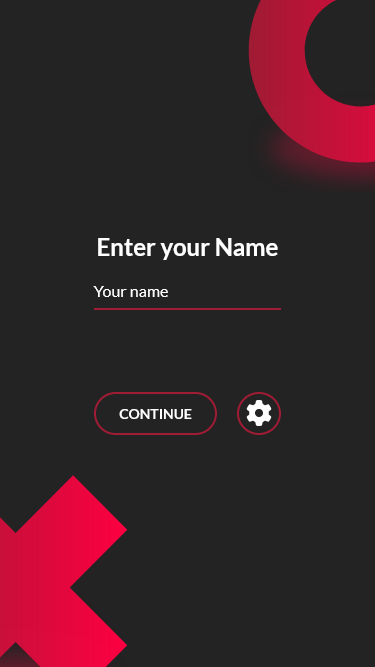
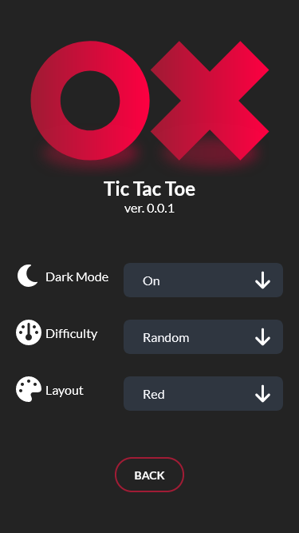
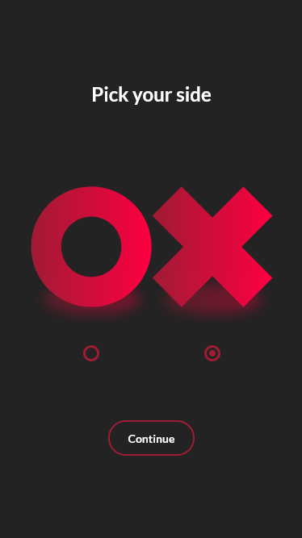
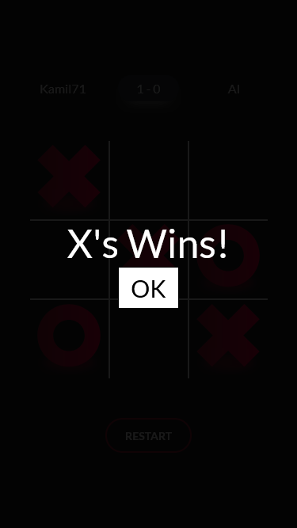

<div align="center">

  <div display="flex">
    
    
  </div>
  <h1>Tic Tac Toe</h1>
  
  <p>
    This is a page reproduced from a mock-up for learning purposes.
  </p>
  
  
<h4>
    <a href="https://github.com/kamil713/tic-tac-toe.git">View Demo</a>
  <span> · </span>
    <a href="https://github.com/kamil713/tic-tac-toe.git">Documentation</a>
  <span> · </span>
    <a href="https://github.com/kamil713/tic-tac-toe.git">Report Bug</a>
</div>

<br />

<!-- Table of Contents -->
# :notebook_with_decorative_cover: Table of Contents

- [About the Project](#star2-about-the-project)
  * [Screenshots](#camera-screenshots)
  * [Tech Stack](#space_invader-tech-stack)
- [Getting Started](#toolbox-getting-started)
  * [Run Locally](#running-run-locally)


<!-- About the Project -->
## :star2: About the Project


<!-- Screenshots -->
### :camera: Screenshots

<div align="center"> 
  
  
  
  
  
  
</div>


<!-- TechStack -->
### :space_invader: Tech Stack

  <ul>
    <li><a href="https://sass-lang.com/">SASS</a></li>
    <li><a href="https://developer.mozilla.org/en-US/docs/Web/JavaScript">JS</a></li>
    <li><a href="https://gulpjs.com/">Gulp</a></li>
  </ul>


<!-- Getting Started -->
## 	:toolbox: Getting Started

<!-- Run Locally -->
### :running: Run Locally

Clone the project

```bash
  git clone https://github.com/kamil713/tic-tac-toe.git
```

Go to the project directory

```bash
  cd tic-tac-toe
```

Install dependencies

```bash
  npm install
```

Start the server

```bash
  gulp
```